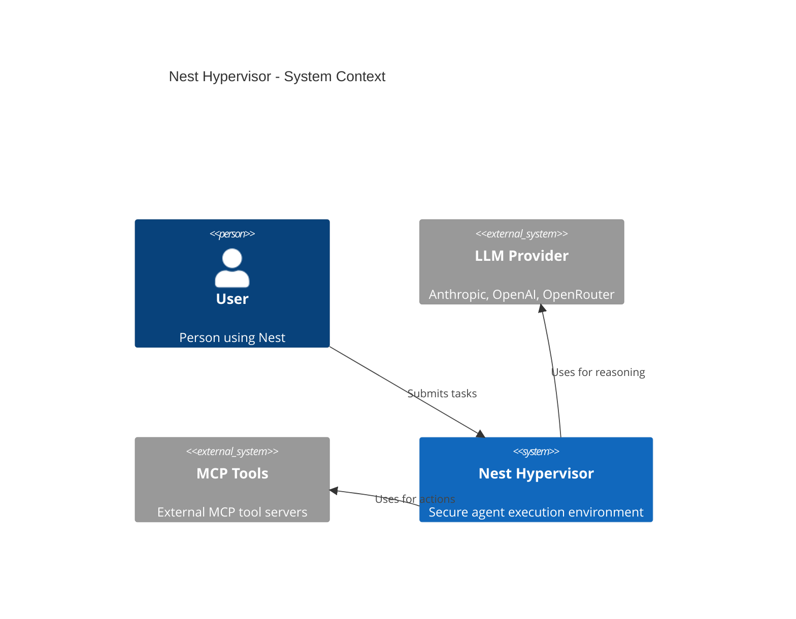
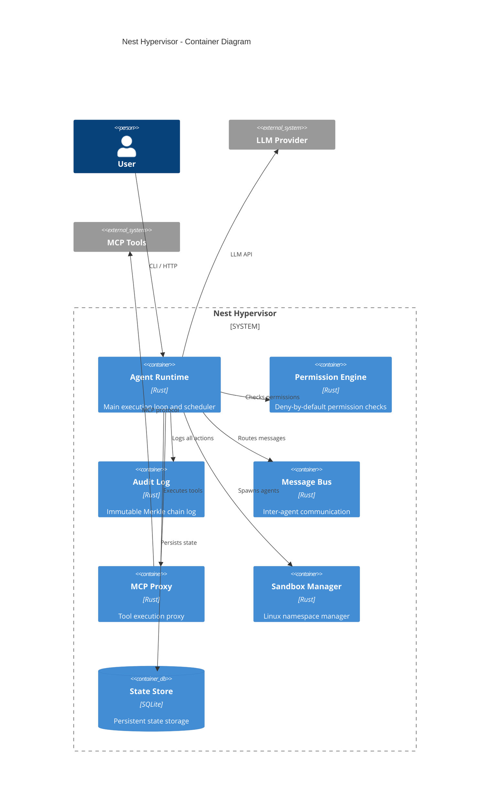
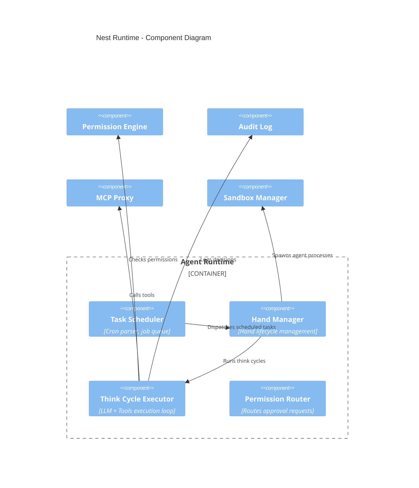
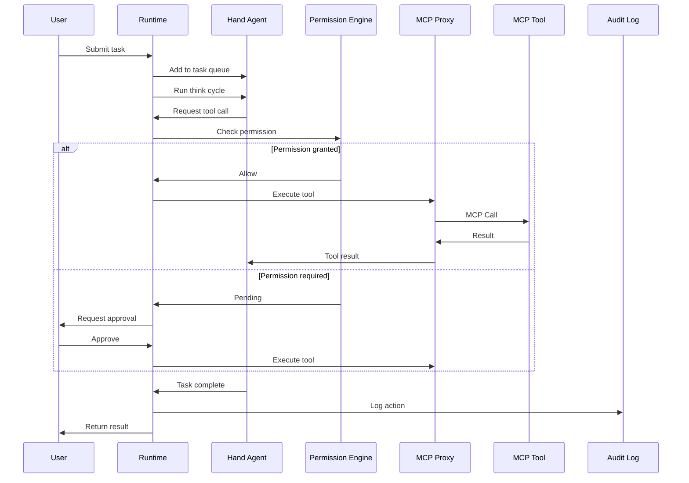

# Nest Architecture

## C4 Model Diagrams

### Level 1: System Context

### Level 2: Container Diagram

### Level 3: Component Diagram

## Core Data Flow

## Design Principles

1. **Security First**: Every operation goes through permission check
2. **Isolation**: No shared memory between agents
3. **Auditability**: Every action is permanently logged
4. **Simplicity**: Minimal API surface, no magic
5. **Composability**: Components work independently

## Security Guarantees

- ✅ Agents cannot escape sandboxes
- ✅ No implicit permissions for any operation
- ✅ All network access is filtered
- ✅ Audit log cannot be modified or deleted
- ✅ Resource limits are enforced at kernel level
